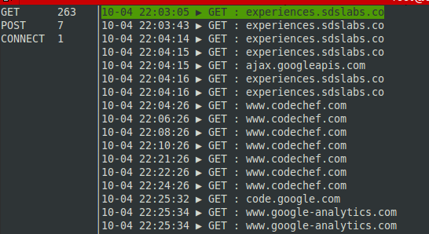

# Konsoole [](https://travis-ci.org/apsdehal/Konsoole)

HTTP monitoring console written in Go. Useful for sniffing and analysis purposes

- Written in Go
- Can write to a custom log file
- Shows all HTTP traffic
- Counts no of type of HTTP Request Method



## Installation and Usage

Just run

```
go get github.com/apsdehal/Konsoole
```
> Installs Konsoole to your machine

*Using Konsoole requires sudo privileges as it binds to network interface*

Now run it via

```
sudo Konsoole
```
Now select one of the possible network interface, most common ones are `wlan0` and `eth0`

```
sudo Konsoole -t logfile.txt
```
> Use this flag to log *extra analysis and data* to a custom log file

*Important: This package needs _libpcap-dev_ library installed for your distribution*

### Testing

Run `go test` for tests on Konsoole.

## Dependencies

- libpcap-dev library
- [akrenmair/gopcap](http://github.com/akrennmair/gopcap)
- [jroimartin/gocui](http://github.com/jroimartin/gocui)

Uses gocui for ncurses bindings and gopcap for pcap bindings 

## Inspiration

Inspired from Python port of this logger [pravj/Doga](http://github.com/pravj/Doga)

## Issues

Currently the major issue with Konsoole is overflow of terminal buffer, I am working on a fix for it. [Issue #2](https://github.com/apsdehal/Konsoole/issues/2) refers to this.

## License

The [BSD 3-Clause license][bsd], the same as the [Go language][golang].
[bsd]: http://opensource.org/licenses/BSD-3-Clause
[golang]: http://golang.org/LICENSE

